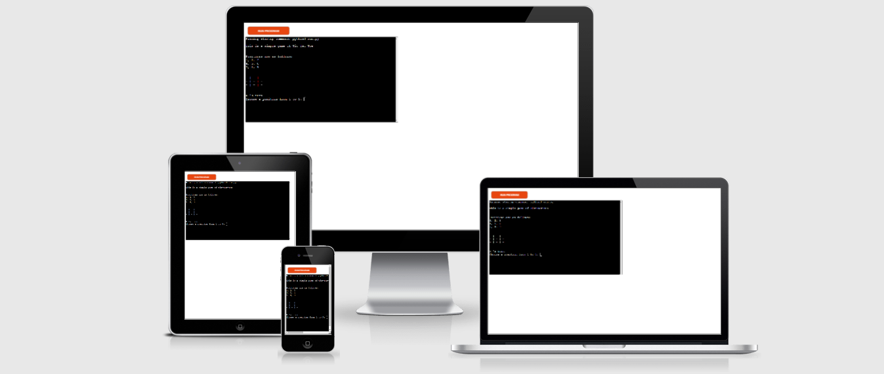
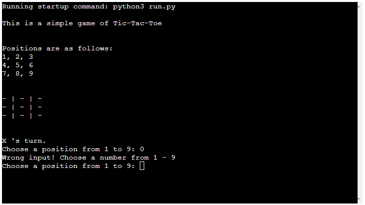

<h1 align="center">Simple Tic-Tac-Toe</h1>


[View the live project here.](https://simple-tic-tac-toe-game-joko.herokuapp.com/)


This is a simple Python terminal Tic-Tac-Toe game, which runs in the Code Institute mock terminal on Heroku

Tic-Tac-Toe is a game in which two players seek in alternate turns to complete a row, a column, or a diagonal with either three O's or three X's drawn in the spaces of a grid of nine squares; noughts and crosses. // Google


<h2 align="center"></h2>

## How to play

- The first player will automatically be assigned "X" and starts the turn. Choose a number from 1 to 9. The turn then goes to player two who has been assigned "O". Repeat the same process.


## Features


-   Automatically assigns you with a symbol, X or O.
-   Accepts user input
-   Input validaton and error-checking
    -   You cannot enter numbers outside the size of the grid
    -   You must enter numbers
    -   You can not enter the same number twice in the same round

<h2 align="center"></h2>


## Features to be added

-   Scoreboard

-   Play vs computer


## Technologies Used


### Languages Used


-   [PYTHON](https://www.python.org/)


### Frameworks, Libraries & Programs Used


1. [Git](https://git-scm.com/)

    - Git was used for version control by utilizing the Gitpod terminal to commit to Git and Push to GitHub.

2. [GitHub:](https://github.com/)

    - GitHub is used to store the projects code after being pushed from Git.

3. [Pythontutor](https://pythontutor.com/)

    - Pythontutor helped me troughout and was a good tool to have when you got stuck.

4. [Heroku](https://www.heroku.com/)

    - Heroku was used to host the project.  

## Testing


The PEP8 Validator were used to validate the project to ensure there were no syntax errors.


-   Python

     - No errors were returned when passing through the PEP8 online validator


### Testing


-   Tested that no invalid or out of bounds inputs are accepted.

-   Tested in my local terminal and the Code Institute Heroku terminal


### Known Bugs


-   Getting an error when entering two invalid inputs after each other.

## Deployment


### Heroku


This project was deployed using Code Institute's mock terminal for Heroku.


1. Fork or clone this Repository

2. Create a new Heroku app

3. Set the buildbacks to Python and NodeJS in that order

4. Link the Heroku app to the repository

5. Click on deploy


### Forking the GitHub Repository


By forking the GitHub Repository we make a copy of the original repository on our GitHub account to view and/or make changes without affecting the original repository by using the following steps...


1. Log in to GitHub and locate the [GitHub Repository](https://github.com/joachimnorden/A-text-based-game)

2. At the top of the Repository (not top of page) just above the "Settings" Button on the menu, locate the "Fork" Button.

3. You should now have a copy of the original repository in your GitHub account.


### Making a Local Clone


1. Log in to GitHub and locate the [GitHub Repository](https://github.com/joachimnorden/A-text-based-game)

2. Under the repository name, click "Clone or download".

3. To clone the repository using HTTPS, under "Clone with HTTPS", copy the link.

4. Open Git Bash

5. Change the current working directory to the location where you want the cloned directory to be made.

6. Type `git clone`, and then paste the URL you copied in Step 3.


```

$ git clone https://github.com/YOUR-USERNAME/YOUR-REPOSITORY

```


7. Press Enter. Your local clone will be created.


```

$ git clone https://github.com/YOUR-USERNAME/YOUR-REPOSITORY

> Cloning into `CI-Clone`...

> remote: Counting objects: 10, done.

> remote: Compressing objects: 100% (8/8), done.

> remove: Total 10 (delta 1), reused 10 (delta 1)

> Unpacking objects: 100% (10/10), done.

```


Click [Here](https://help.github.com/en/github/creating-cloning-and-archiving-repositories/cloning-a-repository#cloning-a-repository-to-github-desktop) to retrieve pictures for some of the buttons and more detailed explanations of the above process.


## Credits


### Code


-   Got some inspiration by this article [askpython](https://www.askpython.com/python/examples/tic-tac-toe-using-python)

-   The algorithm to check win and draw function was taken from this here: [YouTube](https://www.youtube.com/watch?v=JC1QsLOXp-I&ab_channel=JavaCodingCommunity-ProgrammingTutorials)


### Acknowledgements


-   My Partner for supporting me.

-   Tutor support at Code Institute for their support.